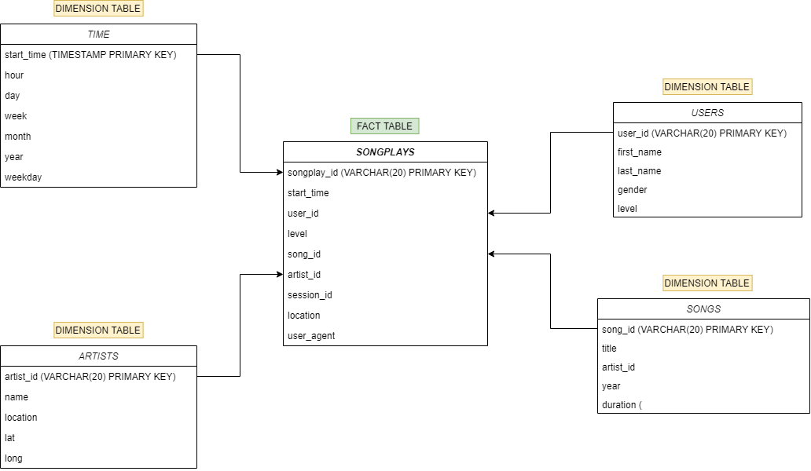

# Instroduction
A startup called Sparkify wants to analyze the data they've been collecting on songs and user activity on their new music streaming app. The analytics team is particularly interested in understanding what songs users are listening to. Currently, they don't have an easy way to query their data, which resides in a directory of JSON logs on user activity on the app, as well as a directory with JSON metadata on the songs in their app.

# How to Use
Run `create_tables.py` from terminal or python console to set up database and tables.
Run `etl.py` from terminal or console to process and load data into database.

# Schema for Song Play Analysis

### Fact Table

* songplays  -  records in log data associated with song plays

### Dimension Tables

*  users  - in the app
*  songs - in music database
*  artists - in music database
*  time

# Purpose of this database
This database allows to aggregate all songs, artists, users and songplays in a single database. In this way, the company disposes of the needed data stored in a unique structure and can thus analyze different scenarios easily. For instance, one can analyze the popularity of different songs or artists. Also, it is possible to perform analysis with geographic information. One can for instance determine which song is popular in which country and region.

# Relevant Files Provided

>test.ipnb - displays the first few rows of each table to let you check your DB
>create_tables.py - drops and created your table
>etl.ipynb - read and processes a single file from song_data and log_data and loads into your tables in Jupyter notebook
>etl.ipynb - read and processes a single file from song_data and log_data and loads into your tables in ETL
>sql_queries.py - containg all your sql queries and in imported into the last three files above

# Data ETL process
Data is extracted from two types of JSON source files: song data from the Million Song Dataset and songplay data from user logs. The JSON files are read into pandas dataframes, processed and uploaded into the database using psycopg2 library.
***
**The ETL process consisted of the following steps**
1) Create: `songplays, users, songs, artist, time` tables
2) Downloading json files and converting them to a file saved in the DataFarme structure (*Pandas Library*)
3) Creating lists of data and saving them to specific tables
4) Reading data from tables
